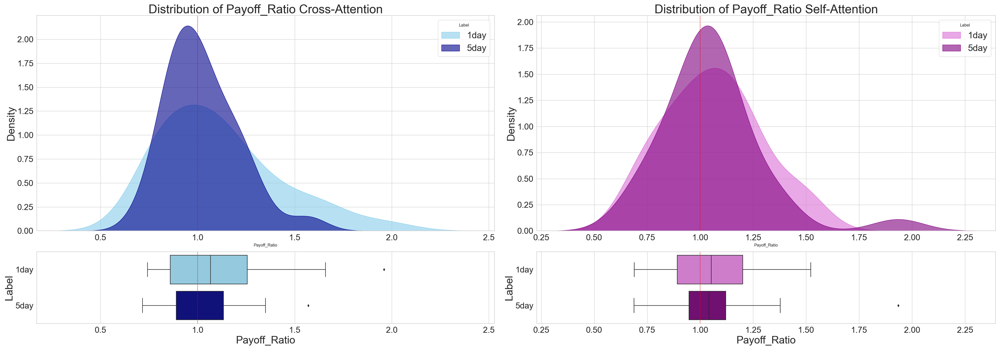

# Multimodal v2 TVD
Multimodal learning model for stock trading using technical-visual data

## Abstract
Traditional unimodal systems rely on a single modality, such as technical indicators, to predict stock price movements. However, this approach is limited to fully capturing the complex patterns of stock price movements. Moreover, the evolving microstructure of the market poses challenges for unimodal stock prediction models to adapt effectively to current market conditions. In this study, a technical-visual dataset was developed to enable comprehensive multimodal learning. The proposed system robustly captures the structural patterns of stock price movements by maintaining the coherence of the open, high, low, and close data within candlestick charts, and reduces noise by incorporating causal embedding to establish comprehensive sequence dependencies between technical indicators and candlestick chart images. Experiments on the top 30 NASDAQ stocks demonstrated that the fusion method with cross-attention achieved an average payoff ratio of 1.115 and a profit factor of 1.250, indicating profitable trading, whereas the self-attention fusion method delivered consistent and low-variance returns with an average payoff ratio of 1.061 and a profit factor of 1.186. Notably, even when the sentiment of the Nasdaq market was bearish in 2022, the proposed model demonstrated high profitability and stability with a payoff ratio and profit factor of 1.092 and 1.127, respectively.  These results highlight that candlestick chart images are an effective visual modality for multimodal learning. Additionally, the labeling methods used showed that one-day labeling for predicting the next day's stock movement yielded high profitability with aggressive trading, whereas five-day labeling improved trading stability.

## Model Framework

## Backtesting Summary

## Analysis of individual stock trade performance 

